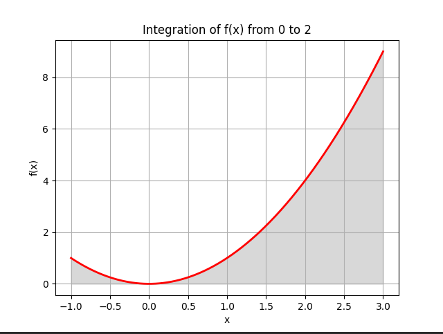

## Product Amount

Lemonade 30
Fruit Juice 20
Total Production 50
Method Result

---

Monte Carlo 2.68365
Quad 2.66667

## Завдання 1: Оптимізація виробництва

Використовуючи бібліотеку PuLP для лінійного програмування, було вирішено задачу оптимізації виробництва двох видів продуктів: "Лимонад" та "Фруктовий сік". Завдання полягало у максимізації загальної кількості продукції з урахуванням обмежених ресурсів: води, цукру, лимонного соку та фруктового пюре.

Результати, отримані від CBC MILP Solver, показали, що для досягнення максимальної загальної кількості продукції (50 одиниць) потрібно виробити 30 одиниць "Лимонаду" та 20 одиниць "Фруктового соку". Це оптимальне рішення враховує всі обмеження на ресурси і демонструє ефективність застосування лінійного програмування для вирішення подібних задач оптимізації.

## Завдання 2: Обчислення визначеного інтеграла методом Монте-Карло

Метод Монте-Карло був використаний для обчислення визначеного інтеграла функції \(f(x) = x^2\) на інтервалі від 0 до 2. Отримане значення інтеграла методом Монте-Карло (2.621712173311222) було порівняно з точним значенням, отриманим за допомогою функції `quad` (2.666666666666667), яке відповідає аналітичному розрахунку інтеграла.

Незначна різниця між результатами демонструє, що метод Монте-Карло може бути ефективним для приблизного обчислення визначених інтегралів, особливо коли аналітичне рішення важко знайти. Однак слід зазначити, що точність методу Монте-Карло залежить від кількості використаних випробувань, і її можна покращити за рахунок збільшення кількості випробувань.

# Загальний висновок

Обидва завдання демонструють важливість і ефективність застосування числових методів і лінійного програмування в різних областях. Результати, отримані за допомогою лінійного програмування та методу Монте-Карло, підтверджують їх придатність для вирішення задач оптимізації та обчислення інтегралів відповідно.
